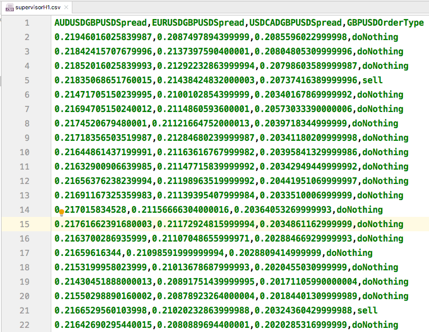
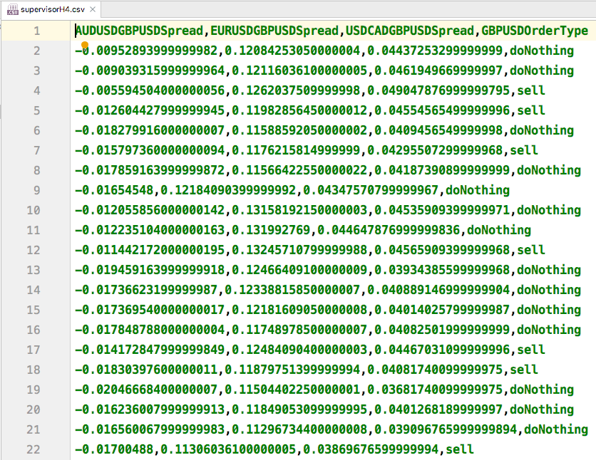
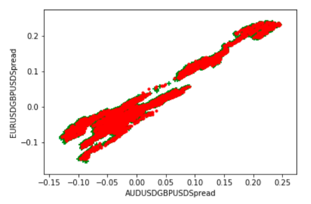
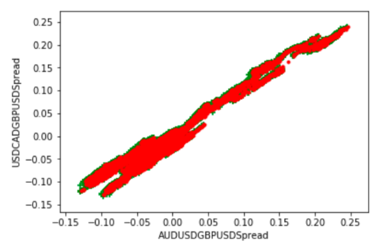

# SVM and kernel SVM in Forex

The goal is to use SVM and Kernel SVM as a classifier to predict 
if we should by or sell a ticker such as EURUSD,GBPUSD,USDCAD.


## supervisors in H1 and H4
### H1 time frame

### H4 time frame






## backtest results in H1
```
print(model.score(X_test,y_test))
0.834556370914
```

## backtest results in H4
```
print(model.score(X_test,y_test))
0.675558519507
```
## conclusion

As can be seen H1 creates better results since efficiency of Financial markets
such as Forex are higher in higher time frames. H1 shows better accuracy because 
we could capture inefficiencies easier and make profit out of it. 
